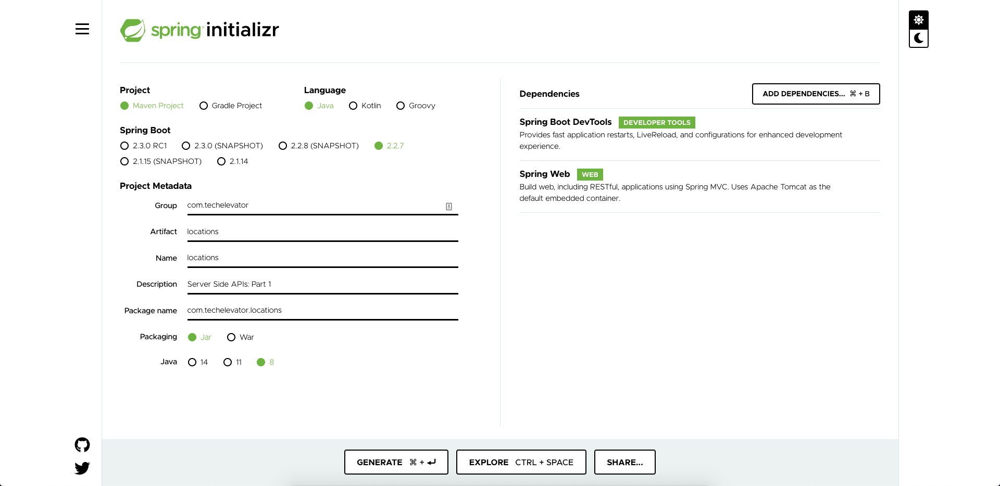
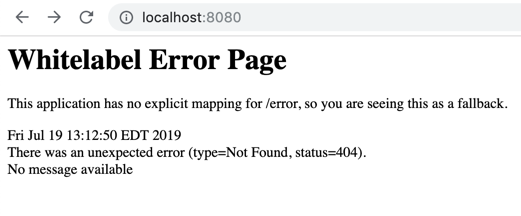

# Server Side APIs: Part 1 Tutorial

In this tutorial, you'll work on an application that uses meetup locations as the data model. In this locations application, you'll create an API that allows others to get a list of locations, as well as the ability to add new ones.

## Step One: Create, import, and run a new project

In this section of the tutorial, you'll create a new project, import it into IntelliJ, and run it.

### Bootstrap your application

The first thing to do is create a new project. You'll use the [Spring Initializr](https://start.spring.io/) to bootstrap your application. Be sure that your project configuration matches the following:

- Project: Maven Project
- Language: Java 11
- Spring Boot: Latest Stable Version
- Group: com.techelevator
- Artifact: locations
- Dependencies: Spring Web Starter, Validation, Spring Boot Devtools



When you click **Generate Project**, it creates a zip file and begins downloading to your computer. When the download is complete, extract the zip file to a location on your hard drive where you want to keep the project.

### Import project into IntelliJ

Import the project into IntelliJ. If you need help doing this, visit the [Import project](https://book.techelevator.com/v2_4/content/guides/intellij.html#import-a-project) section in the IntelliJ How-to Guide.

### Run your project

Now that you've set up your project in IntelliJ, run it to make sure everything works. It's best to make sure the application runs before adding anything new to it.

Open the class `src/main/java/com/techelevator/locations/LocationsApplication.java` and click run next to the `main()` method. Some logging appears in the Console. The last line tells you that the application has started.


If you open a browser window and visit http://localhost:8080, you'll see a screen that looks like this:



Do you know why this error page appears? If you answered, "because there is no route set up for the root context `/`", you're correct. If you try to visit a route that doesn't have a Request Mapping defined, this error page appears by default.

## Step Two: Create the Location controller

Your application is running, but it doesn't do anything yet. This is because you haven't defined any routes or actions to take when someone visits that route. Routes are entry ways into your application, and they're defined inside of a controller.

Before creating any controllers, create a new package called `controllers` inside of your main package `com.techelevator.locations`. This is where your controllers live.

In your new controllers package, create a new class called `LocationController.java`:

```java
package com.techelevator.locations.controllers;

public class LocationController {

}
```
Next, use the `@RestController` annotation to tell the Spring Framework that this class is a REST Controller class:

```java
package com.techelevator.locations.controllers;

import org.springframework.web.bind.annotation.RestController;

@RestController
public class LocationController {

}
```

## Step Three: Create a Location model

Like most applications, you need data to make it interesting. This could come from many different places like a local file, a database, or even another API. In this tutorial, you'll store the data in a `List<>`.

In the previous command-line application, the Location model had the following properties:

- id
- name
- address
- city
- state
- zip

Now that you know what properties make up your model, you need to create one. To get started, create a new package called `model` where your models live.

In that package, create a class called `Location.java` and paste in the following code:

```java
package com.techelevator.locations.model;

public class Location {

    private int id;
    private String name;
    private String address;
    private String city;
    private String state;
    private String zip;

    public Location() {
    }

    public Location(int id, String name, String address, String city, String state, String zip) {
        this.id = id;
        this.name = name;
        this.address = address;
        this.city = city;
        this.state = state;
        this.zip = zip;
    }

    public int getId() {
        return id;
    }

    public void setId(int id) {
        this.id = id;
    }

    public String getName() {
        return name;
    }

    public void setName(String name) {
        this.name = name;
    }

    public String getAddress() {
        return address;
    }

    public void setAddress(String address) {
        this.address = address;
    }

    public String getCity() {
        return city;
    }

    public void setCity(String city) {
        this.city = city;
    }

    public String getState() {
        return state;
    }

    public void setState(String state) {
        this.state = state;
    }

    public String getZip() {
        return zip;
    }

    public void setZip(String zip) {
        this.zip = zip;
    }

    @Override
    public String toString() {
        return "Location [id=" + id + ", name=" + name + "]";
    }
}
```

> Java is verbose when it comes to Plain old Java Objects (POJOs), but thankfully, you don't have to type all of that code. If you're creating your own Model, type out the properties and then use the IDE to generate Constructors, Getters, Setters, and toString() methods.

With your model in place, you can set up some initial data to expose in your API:

```java
@RestController
public class LocationController {

    private List<Location> locations = new ArrayList<>();

    public LocationController() {
        locations.add(new Location(1,
                "Baker Electric Building",
                "7100 Euclid Ave",
                "Cleveland",
                "OH",
                "44103"));
        locations.add(new Location(2,
                "Rev1 Ventures",
                "1275 Kinnear Rd",
                "Columbus",
                "OH",
                "43212"));
        locations.add(new Location(3,
                "HCDC Business Center",
                "1776 Mentor Ave",
                "Cincinnati",
                "OH",
                "45212"));
        locations.add(new Location(4,
                "House of Metal",
                "901 Pennsylvania Ave",
                "Pittsburgh",
                "PA",
                "15233"));
        locations.add(new Location(5,
                "TechTown Detroit",
                "440 Burroughs St",
                "Detroit",
                "MI",
                "48202"));
        locations.add(new Location(6,
                "Duane Morris Plaza",
                "30 S 17th St",
                "Philadelphia",
                "PA",
                "19103"));
    }

}
```

## Step Four: Get a list of locations

Now you've set up a basic controller, a model that represents a location, and some initial data. The first method you'll expose in your API is a way to get a list of all the locations.

To do so, you'll set up a `RequestMapping` for `/locations`. This method returns the list of locations, and thanks to Spring, it's converted to an array of JSON objects:

```java
@RequestMapping( path = "/locations", method = RequestMethod.GET)
public List<Location> list() {
    return locations;
}
```

You can visit http://localhost:8080/locations using the browser, since this is a `GET` request, or you can use Postman. You'll get a list of locations in JSON format.

## Step Five: Add a location

You know how to get a list of the locations; now, you need to add a location. The path for this is still `/locations`, which is the same path as the previous one.

The only difference is the request method that this method accepts, `RequestMethod.POST`. This allows you to have the same path for similar resources, which are usually grouped within the same controller.

To define the method, use the `RequestMethod` `POST`:

```java
@RequestMapping( value = "/locations", method = RequestMethod.POST)
public Location add(@RequestBody Location location) {
    if( location != null ) {
        locations.add(location);
        return location;
    }
    return null;
}
```

Unlike the `GET` example, you can't visit the `POST` `/locations` in the browser. If you try to, the browser runs a `GET` operation and you're returned the list of locations.

You need to open Postman, and send a `POST` request to `/locations`. Make sure to set the `Content-Type` header to `application/json`, or set the body format to "raw" and "JSON."

In the body of the request, enter the following JSON content that sends a new location:

```js
{
	"id": 7,
	"name": "Hawaiian Beach",
	"address": "1234 Kalia Rd",
	"city": "Honolulu",
	"state": "HI",
	"zip": "96815"
}
```

If you followed the instructions correctly, you'll see a status code of 200 after you hit "Send."

If you run another `GET` on `/locations`, you'll see your new location added to the list.


## Step Six: Return a random location

Now, you need to create one additional route in your API:

- Random
  - path: /locations/random
  - return: a random Location from the list of locations

Try to work on the problem by yourself before you move on and see what the solution might look like.

## Solution

This is what your controller looks like when you've completed the tutorial:

```java
package com.techelevator.locations.controllers;

import com.techelevator.locations.model.Location;
import org.springframework.web.bind.annotation.RequestBody;
import org.springframework.web.bind.annotation.RequestMapping;
import org.springframework.web.bind.annotation.RequestMethod;
import org.springframework.web.bind.annotation.RestController;

import java.util.ArrayList;
import java.util.List;
import java.util.Random;

@RestController
public class LocationController {

    private List<Location> locations = new ArrayList<>();

    public LocationController() {
        locations.add(new Location(1,
                "Baker Electric Building",
                "7100 Euclid Ave",
                "Cleveland",
                "OH",
                "44103"));
        locations.add(new Location(2,
                "Rev1 Ventures",
                "1275 Kinnear Rd",
                "Columbus",
                "OH",
                "43212"));
        locations.add(new Location(3,
                "HCDC Business Center",
                "1776 Mentor Ave",
                "Cincinnati",
                "OH",
                "45212"));
        locations.add(new Location(4,
                "House of Metal",
                "901 Pennsylvania Ave",
                "Pittsburgh",
                "PA",
                "15233"));
        locations.add(new Location(5,
                "TechTown Detroit",
                "440 Burroughs St",
                "Detroit",
                "MI",
                "48202"));
        locations.add(new Location(6,
                "Duane Morris Plaza",
                "30 S 17th St",
                "Philadelphia",
                "PA",
                "19103"));
    }

    @RequestMapping( path = "/locations", method = RequestMethod.GET )
    public List<Location> list() {
        return locations;
    }

    @RequestMapping( value = "/locations", method = RequestMethod.POST)
    public Location add(@RequestBody Location location) {
        if( location != null ) {
            locations.add(location);
            return location;
        }
        return null;
    }

    @RequestMapping( path = "/locations/random", method = RequestMethod.GET )
    public Location random() {
        return locations.get(new Random().nextInt(locations.size()));
    }

}
```

## Summary

In this tutorial, you learned:

- How to create a new Spring Boot application using the Spring Initializr
- How to create a Rest Controller
- How to create Request Mappings to respond to requests
- How to test your API in Postman
