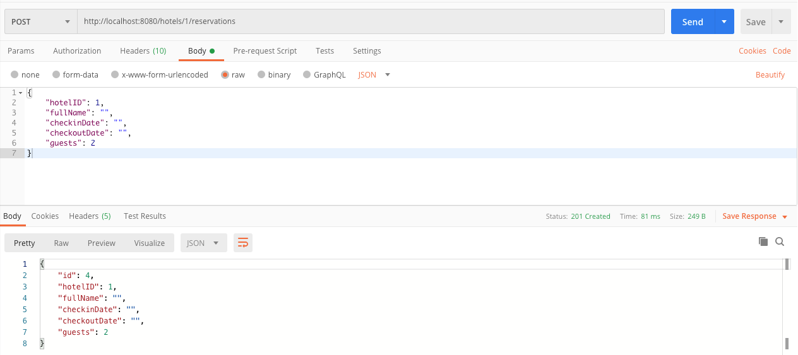

# Server-Side APIs: Part 2 - Java Lecture Notes

In this lecture, you continued working with the hotel reservation API. You focused on validating data, informing the client when an error occurs, and adding the ability to update and delete a reservation.

When you completed the changes for this application, you could run the command-line client that you used throughout the week. You didn't need to change any client code because the API you've built out over the past two days follows the same contract as the fake one.

## Running the application

First, open the Hotel Reservations application in IntelliJ. Remember to run the server application to make sure everything works before adding any new code.

## Dependency Injection

Before making any modifications, notice the change that has been made to the lecture code from yesterday. The `HotelController` is accepting a `HotelDao` and a `ReservationDao` as constructor parameters instead of creating instances directly. This is an example of the Spring Framework's Dependency Injection functionality. Read More here: https://v2-4-techelevator-book.netlify.app/content/dependency-injection.html#dependency-injection

Next, open up the `MemoryReservationDao` and notice the use of the `@Component` annotation, this is how Spring is "aware" of the existence of this class and is able to inject it as a dependency at runtime automatically. Also notice that `MemoryReservationDao` is rely upon Dependency Injection to get an instance of `HotelDao`.

Dependency Injection can seem complicated at first, even to experienced programmers, but that you'll continue to see examples of it and it'll become more intuitive over time.

## Reservation data validation

As you saw in previous lecture, you can create a new reservation from the command-line client application. If you didn't fill in all the required data, the command-line application threw an error and didn't call the server. This is called **client-side validation**. Although this is a good practice, you must also validate the data on the server.

While the server runs, open Postman and show the students an example of sending a `POST` request with blank data. Point out that the new reservation is still created even though you sent empty values.



To fix this, you can add in some data validation. You can perform data validation in two steps.

First, you need to add constraints to your model. Then, add the `@Valid` annotation before the request body parameter in the controller to signal to Spring that you want to perform validation.

Begin by adding the correct constraints to the `Reservation` model. Additionally, even though you won't use the custom messages in the front-end application, it's good practice to start using them now.

This might be a good time to look at the [Java API](https://javaee.github.io/javaee-spec/javadocs/javax/validation/constraints/NotBlank.html) to explore the different types of constraints:

```java
public class Reservation {

    private int id;
    @Min( value = 1, message = "The field 'hotelID' is required.")
    private int hotelID;
    @NotBlank( message = "The field 'fullName' is required.")
    private String fullName;
    @NotBlank( message = "The field 'checkinDate' is required.")
    private String checkinDate;
    @NotBlank( message = "The field 'checkoutDate' is required.")
    private String checkoutDate;
    @Min( value = 1, message = "The minimum number of guests is 1")
    @Max( value = 5, message = "The maximum number of guests is 5")
    private int guests;

}
```

Why not use an annotation like `@NotNull` for `hotelID`? The answer is because you're using the `int` data type here, so if you don't set anything, it defaults to `0`.

> The curriculum team decided to keep the `checkinDate` and `checkoutDate` as strings to keep the Jackson mapping simple. If these were `LocalDate` types, there are some useful constraints like `@FutureOrPresent` to make sure the date is after the present.

Finally, in the `addReservation()` method in the controller, add the `@Valid` annotation before the Reservation argument. This tells Spring to perform validation using the constraints you defined. If validation fails, the controller method throws a `400` Bad Request:

```java
@ResponseStatus(HttpStatus.CREATED)
@RequestMapping( path = "/hotels/{id}/reservations", method = RequestMethod.POST)
public Reservation addReservation(@Valid @RequestBody Reservation reservation, @PathVariable("id") int hotelID) throws HotelNotFoundException {
    return reservationDao.create(reservation, hotelID);
}
```

Go back to Postman and show the errors being thrown when you send invalid data in.

### RESTful response codes

The response code is now `400 Bad Request` for this empty request. Using HTTP response codes is a way for the server to let the client know what happened to the request. Responding with HTTP status codes is one part of what makes an API "RESTful." Some points to highlight:

- `2xx` codes are success codes. See the Postman tab where the `POST` request succeeded. The server returned `201 Created` when the validation wasn't in place.
  - You'll see how the server returned that response code in a moment.
- `4xx` codes are client error codes. `400 Bad Request` is for when the server can't or won't process the request due to an apparent client error. In this case, the data was invalid based on the validation rules.
  - The server responding with a `400 Bad Request` is due to the `@Valid` annotation, which tells Spring to pass this object through a Validator before doing anything else.

## CRUD

As mentioned in earlier days and content, CRUD stands for "**C**reate **R**etrieve **U**pdate **D**elete." So far, you have seen the "Create" and "Retrieve" parts in the `POST` and `GET` HTTP methods, respectively. You'll add the "Update" and "Delete" parts so the application provides full CRUD functionality.

## Update reservation

With data validation in place, you can move on to the update method. There are a few things to point out about this method.

First, you want to use the same validation rules as you do when creating a new reservation. To do this, add the `@Valid` annotation in front of the reservation argument. Second, discuss what the `ReservationNotFoundException` class is and why it's a good idea to have one:

```java
@RequestMapping(path = "/reservations/{id}", method = RequestMethod.PUT)
public Reservation update(@Valid @RequestBody Reservation reservation, @PathVariable int id) throws ReservationNotFoundException {
    return reservationDao.update(reservation, id);
}
```

Test both a valid reservation and an invalid reservation ID in Postman. Again, performing all of your testing in Postman gets the students in the habit of doing the same.

## Delete reservation

The delete method is similar to the update method, but make sure to add the `HttpStatus.NO_CONTENT` response status:

```java
@ResponseStatus(HttpStatus.NO_CONTENT)
@RequestMapping(path = "/reservations/{id}", method = RequestMethod.DELETE)
public void delete(@PathVariable int id) throws ReservationNotFoundException {
    reservationDao.delete(id);
}
```

Test both a valid reservation and an invalid reservation ID in Postman. You can also try deleting the same reservation a second time to see the `404` response.

## Command-Line console application

Now that the API works, it's time to hook up the command-line client. This is the same console application you've been using. 

Now that the API is running, start the command-line client and test each of the menu options.
