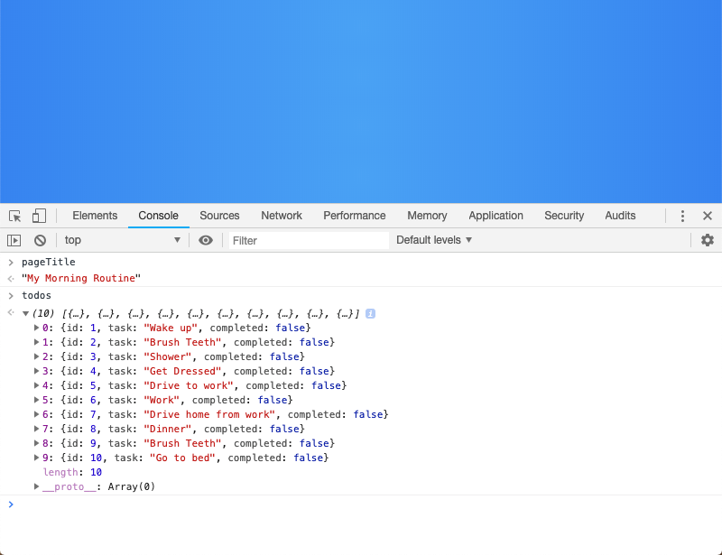
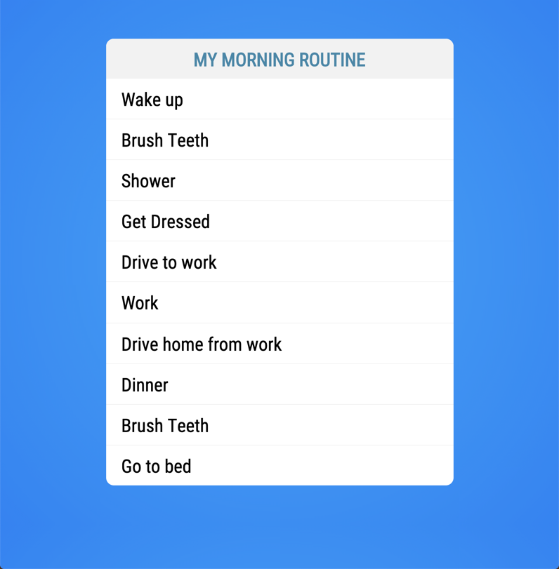

# Introduction to the DOM Tutorial

In this tutorial, you'll be introduced to a Todo application that you'll use over the next few weeks. The starting code for this tutorial is located in this directory in the folder `todo`. The objective of this project is to get some practice making changes to the DOM.

## Todo app

If you take a look at the `index.html` template, you'll notice that there isn't much going on. You have a container `div` with an id of todos. In this element, you'll add an `h1` tag, `ul`, and a list (`li`) of tasks:

```html
<html>
<body>
    <div id="todos" class="todo-list">
        <!-- YOUR CONTENT GOES HERE -->
    </div>
    <script src="js/app.js"></script>
</body>
</html>
```

All the work you'll do for this tutorial is located `js/app.js`, so open that now.

The first thing you need to do is to get a reference to the container element, which has an id of `todos`. If you remember from the reading material, you should always reach for `getElementById()` if the element has an id:

```js
const todoList = document.getElementById('todos');
```

Next, you'll set up some variables for your page title and array of todos. These values will change later, so make sure to use `let` instead of `const`:

```js
let todos = [];
let pageTitle = '';
```

Next, you'll create a method that assigns a page title and array of todos:

```js
function init() {
  pageTitle = 'My Morning Routine';
  todos = [
    { id: 1, task: 'Wake up', completed: false },
    { id: 2, task: 'Brush Teeth', completed: false },
    { id: 3, task: 'Shower', completed: false },
    { id: 4, task: 'Get Dressed', completed: false },
    { id: 5, task: 'Drive to work', completed: false },
    { id: 6, task: 'Work', completed: false },
    { id: 7, task: 'Drive home from work', completed: false },
    { id: 8, task: 'Dinner', completed: false },
    { id: 9, task: 'Brush Teeth', completed: false },
    { id: 10, task: 'Go to bed', completed: false }
  ]
}
```

At the bottom of the template, call this `init()` method to initialize your data:

```js
// set up the page title and tasks
init();
```

Now, you can run the tutorial using live server and print out the values of `pageTitle` and `todos` to the console.



### Add a page title

Next, you'll create a method to add your page title to your web page. There isn't an `h1` that you can add data to, so before you can set the page title, you'll need to create an element. Once you have a reference to that element, you can set the inner text of that element to the page title you initialized.

Finally, you can use the `todoList` that you got a reference to earlier and append your new `h1` element to it:

```js
function addPageTitle() {
  const heading = document.createElement('h1')
  heading.innerText = pageTitle;
  todoList.appendChild(heading);
}
```

Right after you call `init()`, call your `addPageTitle()` method:

```js
// set up your page title and tasks
init();
// // add page title to the DOM
addPageTitle();
```

### Adding todos

In this step, you'll create a method called `addTodos`. In this method, you'll create a new unordered list `<ul>` element, get a reference to it, and append it to your `todoList` container. With that reference, you'll add a new list item `<li>` for each todo in the array:

```js
function addTodos() {
  const ul = document.createElement('ul');
  todoList.appendChild(ul);
}
```

Each list item that you add to the DOM looks like this:

``` html
<li>
    Your Task Name
</li>
```

You can use a for each loop here to iterate over each todo in the array. During each iteration, you'll create a new list item element and set the inner text to the value from `todo.task`:

```js
todos.forEach(todo => {
    const li = document.createElement('li')
    li.innerText = todo.task
    ul.appendChild(li)
});
```

Finally, call your `addTodos()` method below your two other calls.

```js

// set up your page title and tasks
init();
// // add page title to the DOM
addPageTitle();
// // add the task to the DOM
addTodos();
```

If you run the application, you should get a list of all the todos in the array.

## My morning routine

If you followed the tutorial correctly, you can run the application and see the following. If you don't see the application, look in the console so you can find out why.



This is what the final solution for this tutorial looks like:

```js
const todoList = document.getElementById('todos');

let todos = [];
let pageTitle = '';

function init() {
  pageTitle = 'My Morning Routine';
  todos = [
    { id: 1, task: 'Wake up', completed: false },
    { id: 2, task: 'Brush Teeth', completed: false },
    { id: 3, task: 'Shower', completed: false },
    { id: 4, task: 'Get Dressed', completed: false },
    { id: 5, task: 'Drive to work', completed: false },
    { id: 6, task: 'Work', completed: false },
    { id: 7, task: 'Drive home from work', completed: false },
    { id: 8, task: 'Dinner', completed: false },
    { id: 9, task: 'Brush Teeth', completed: false },
    { id: 10, task: 'Go to bed', completed: false }
  ]
}

function addPageTitle() {
  const heading = document.createElement('h1')
  heading.innerText = pageTitle;
  todoList.appendChild(heading);
}

function addTodos() {
  const ul = document.createElement('ul');
  todos.forEach(todo => {
    const li = document.createElement('li')
    li.innerText = todo.task
    ul.appendChild(li)
  });
  todoList.appendChild(ul);
}

// set up your page title and tasks
init();
// // add page title to the DOM
addPageTitle();
// // add the task to the DOM
addTodos();

```

